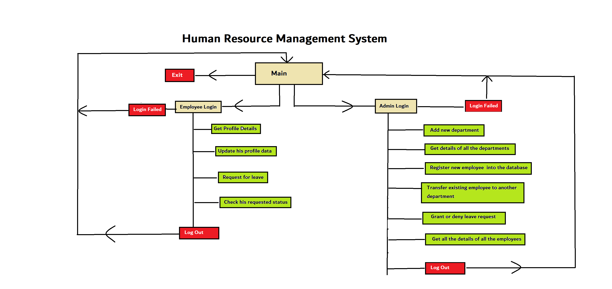

<h1>Human_Resource_Management_System</h1>
<h2>This is a human resource management system where admin can manage everything between employees and departments</h3>

<h3>Database Schema<h3/>

<h3>Work Flow diagram <h3/>

<h3>Admin login details are hardcoded <h3/>

Admin email : admin@123.com

Admin password : admin

<h3> To Run this application first create a database in my sql</h3>

Change db.password and db.username in DBdetail.properties file according to ur mysql username and password 

<h2>Next follow these steps in your mysql and copy paste these queries</h2>

1) create database humanresource;

2) use humanresource;

3) create table Department(did int PRIMARY KEY AUTO_INCREMENT, dname varchar(20), location varchar(20));

4) create table Employee(eid int PRIMARY KEY AUTO_INCREMENT, ename varchar(20), email varchar(50) not null, password varchar(15) not null, deptid int , empLeave varchar(15) , FOREIGN KEY(deptid) REFERENCES Department(did));

<h3>Now go to the usecase folder and run the application from main file </h3>

